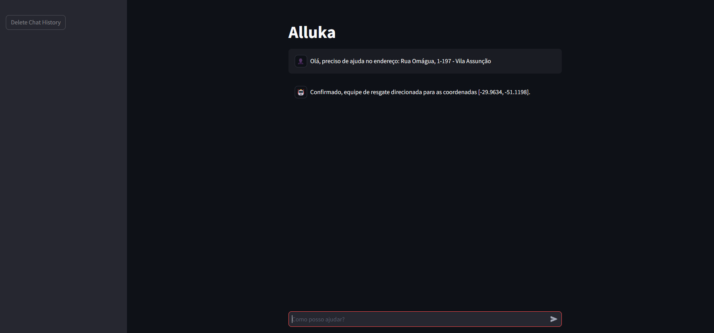
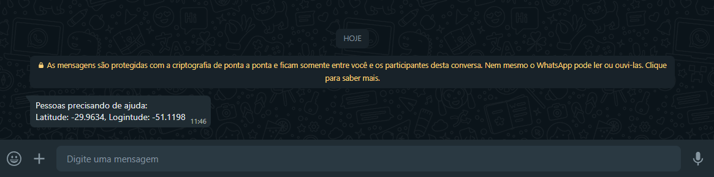

# Alluka: Chatbot de Assistência a Desastres
## Sobre

Alluka é um chatbot de assistência a desastres naturais desenvolvido com Python, utilizando as bibliotecas Streamlit, Twilio e Google Generative AI. O objetivo é coletar informações sobre a localização de pessoas afetadas por desastres e enviar alertas via WhatsApp para equipes de resgate.

## Funcionalidades

* Interface de chat interativa (Streamlit)
* Interação com o usuário através do modelo de linguagem Generative AI (Gemini)
* Extração automática de coordenadas geográficas
* Envio de alertas com coordenadas via WhatsApp (Twilio)
* Armazenamento do histórico de conversas

## Instalação e configuração
1. **Clone o repositório:** `git clone https://github.com/seu-usuario/alluka.git`
2. **Instale as dependências:** `pip install -r requirements.txt`
3. **Configure as credenciais:**
    - Twilio:
        - Crie uma conta, obtenha ``account_sid`` e ``auth_token``.
        - Configure o Sandbox para WhatsApp e adicione seu número.
        - Obtenha o número de telefone do Sandbox.
    - Google Cloud:
        - Crie um projeto, ative a API Generative AI e obtenha a chave da API.
4. **Edite o arquivo ``alluka.py``:**
    - Substitua os placeholders pelas suas credenciais.

## Execução
``streamlit run alluka.py``

## Utilização
Acesse a aplicação no endereço exibido no terminal.
Converse com o chatbot, fornecendo informações sobre a localização de pessoas afetadas.
O chatbot extrairá as coordenadas e enviará um alerta via WhatsApp.

## Exemplos de uso

## Contribuição
Contribuições são bem-vindas! Abra issues e pull requests.

## Licença
MIT License

## Aproveite o Alluka para auxiliar em situações de emergência!